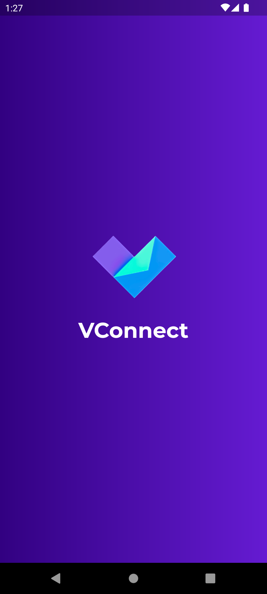
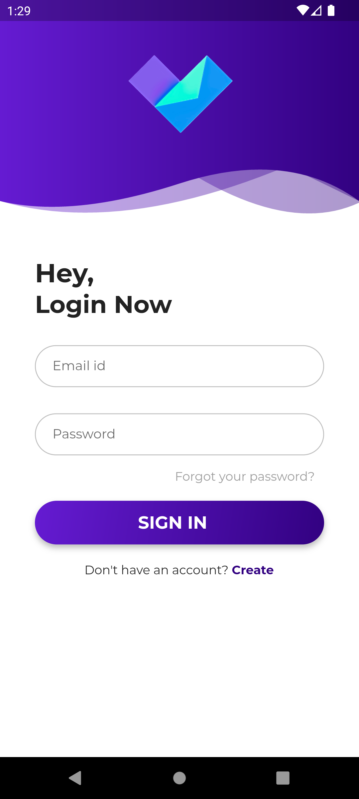
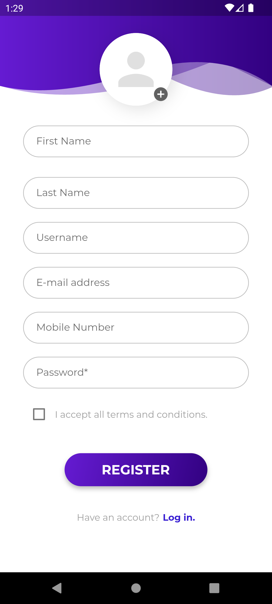
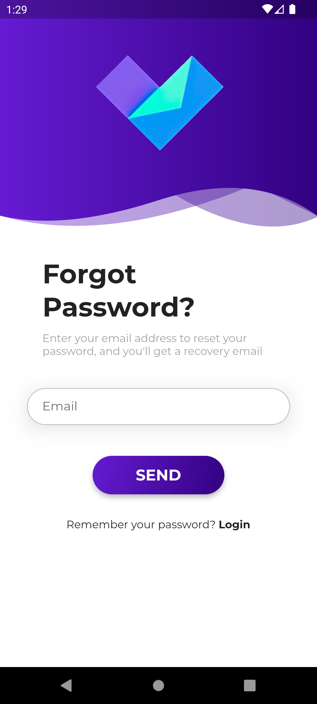
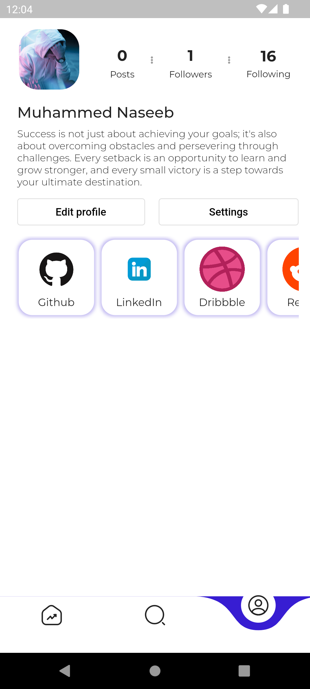

# V-Connect

### Mini Social Network
This is a mini social network built using Flutter and Firebase. The application allows users to sign up, sign in, create a profile, search for other users, view other users' profiles, make them friends/unfriend them, and view a list of mutual friends between users.

## Solution and Choices

This application is built using Flutter, which provides a modern way of building user interfaces. Firebase is used as a backend service, which provides authentication, real-time database, and storage functionalities. The application uses Firebase Authentication to allow users to sign up and sign in to the application securely. 

The users' profiles are stored in the Firebase Realtime Database, and the application uses Firebase Storage to store the users' profile pictures. The users can search for other users using their usernames, and they can view other users' profiles, make them friends or unfriend them. 

The application also shows a list of mutual friends between two users. A mutual friend is a user who is a friend of two other users who may or may not know each other. The list of mutual friends is generated by comparing the lists of friends of the two users.

## Current Features

1. Able to Sign In/Sign Up to the app
2. username validation perfromed when account creation
3. Forgot password screens is added
4. Profile screen ui added

## Demo Video

Here's a [demo video](https://drive.google.com/file/d/1SygRQD7-kfcFb37-1lNAUfFrfQ_4P5TU/view?usp=share_link) of the application.

## Screenshots

|                                                Splash Screen                                                 |                                                 Login Screen                                                  |                                                Register Screen                                                 |                                                  Forgot Password Screen                                                  |
| :---------------------------------------------------------------------------------------------------------: | :--------------------------------------------------------------------------------------------------------------: | :----------------------------------------------------------------------------------------------------------: | :--------------------------------------------------------------------------------------------------------------: |
|  |  |  |  |

|                                                Profile Screen                                                 |
| :---------------------------------------------------------------------------------------------------------: |
|  |

## Running the Code

To run the code, follow these steps:

1. Clone this repository using `git clone https://github.com/Naseeb-Nex/V-Connect`
2. Open the project in your favorite code editor.
3. Make sure you have the Flutter SDK installed.
4. Run the command `flutter pub get` to install the required dependencies.
5. Create a Firebase project and enable authentication and Firestore.
6. Replace the `google-services.json` file in the `android/app` directory with the one generated for your Firebase project.
7. Run the command `flutter run` to launch the application on your device or emulator.

## Dependencies

- Firebase/Core
- Firebase/Auth
- Firebase/Firestore
